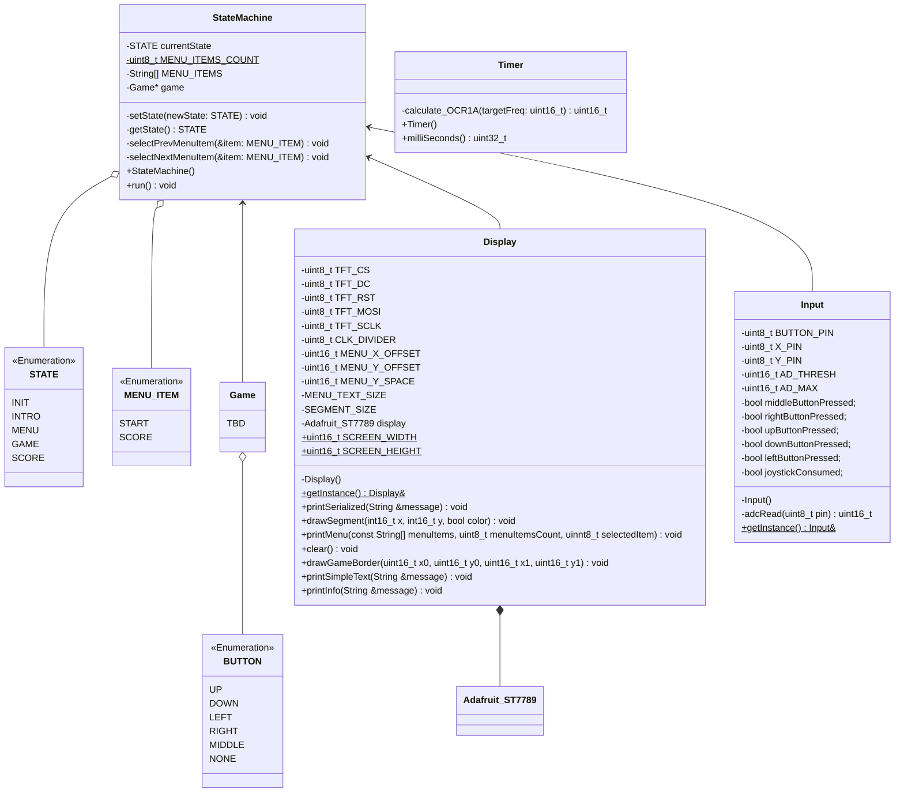

# Klassendiagramm

```mermaid
  classDiagram

  StateMachine o-- STATE
  StateMachine o-- MENU_ITEM
  StateMachine <-- Game
  StateMachine <-- Display
  StateMachine <-- Input
  Game o-- BUTTON
  Display *-- Adafruit_ST7789

  class Timer {
    -calculate_OCR1A(targetFreq: uint16_t) uint16_t
    +Timer()
    +milliSeconds() uint32_t
  }

  class StateMachine {
    -STATE currentState
    -uint8_t MENU_ITEMS_COUNT$
    -String[] MENU_ITEMS
    -Game* game
    -setState(newState: STATE) void
    -getState() STATE
    -selectPrevMenuItem(&item: MENU_ITEM) void
    -selectNextMenuItem(&item: MENU_ITEM) void
    +StateMachine()
    +run() void
  }

  class STATE {
    <<Enumeration>>
    INIT
    INTRO
    MENU
    GAME
    SCORE
  }
  class MENU_ITEM {
    <<Enumeration>>
    START
    SCORE
  }

  class Game {
    %% TODO
    TBD
  }

  class Input {
    -uint8_t BUTTON_PIN
    -uint8_t X_PIN
    -uint8_t Y_PIN
    -uint16_t AD_THRESH
    -uint16_t AD_MAX
    -bool middleButtonPressed;
    -bool rightButtonPressed;
    -bool upButtonPressed;
    -bool downButtonPressed;
    -bool leftButtonPressed;
    -bool joystickConsumed;
    -Input()
    -adcRead(uint8_t pin) uint16_t
    +getInstance()$ Input&
  }

  class BUTTON {
    <<Enumeration>>
    UP
    DOWN
    LEFT
    RIGHT
    MIDDLE
    NONE
  }

  class Display {
    -uint8_t TFT_CS
    -uint8_t TFT_DC
    -uint8_t TFT_RST
    -uint8_t TFT_MOSI
    -uint8_t TFT_SCLK
    -uint8_t CLK_DIVIDER
    -uint16_t MENU_X_OFFSET
    -uint16_t MENU_Y_OFFSET
    -uint16_t MENU_Y_SPACE
    -MENU_TEXT_SIZE
    -SEGMENT_SIZE
    -Display()
    -Adafruit_ST7789 display
    +uint16_t SCREEN_WIDTH$
    +uint16_t SCREEN_HEIGHT$
    +getInstance()$ Display&
    +printSerialized(String &message) void
    +drawSegment(int16_t x, int16_t y, bool color) void
    +printMenu(const String[] menuItems, uint8_t menuItemsCount, uinnt8_t selectedItem) void
    +clear() void
    +drawGameBorder(uint16_t x0, uint16_t y0, uint16_t x1, uint16_t y1) void
    +printSimpleText(String &message) void
    +printInfo(String &message) void
  }
```
