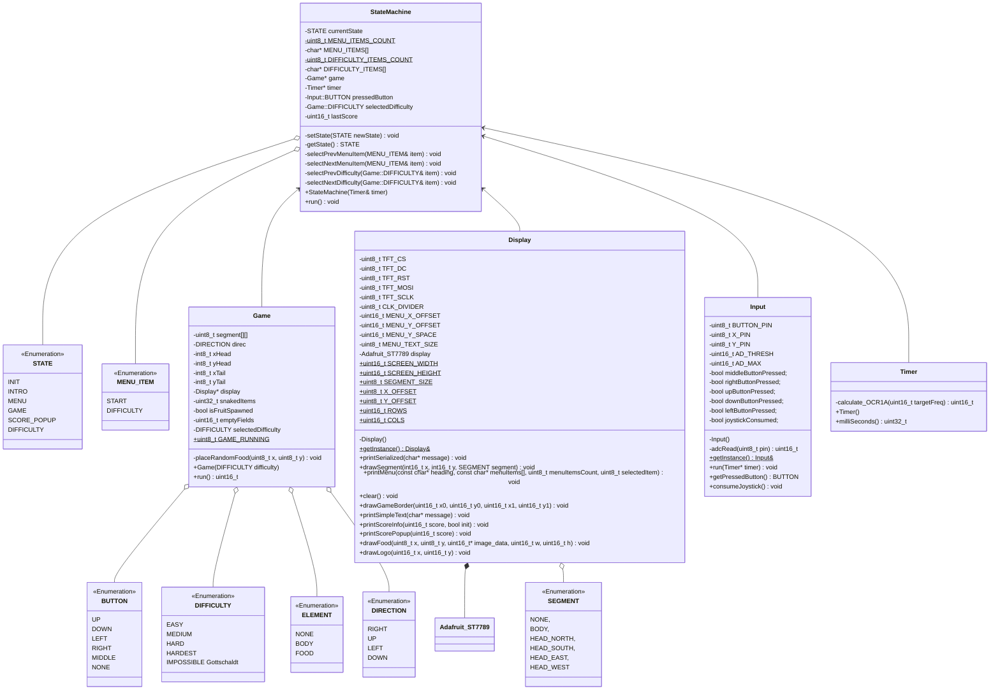

# Klassendiagramm

```mermaid
  classDiagram

  StateMachine o-- STATE
  StateMachine o-- MENU_ITEM
  StateMachine <-- Game
  StateMachine <-- Display
  StateMachine <-- Input
  StateMachine <-- Timer
  Game o-- BUTTON
  Game o-- DIFFICULTY
  Game o-- ELEMENT
  Game o-- DIRECTION
  Display *-- Adafruit_ST7789
  Display o-- SEGMENT

  class Timer {
    -calculate_OCR1A(uint16_t targetFreq) uint16_t
    +Timer()
    +milliSeconds() uint32_t
  }

  class StateMachine {
    -STATE currentState
    -uint8_t MENU_ITEMS_COUNT$
    -char* MENU_ITEMS[]
    -uint8_t DIFFICULTY_ITEMS_COUNT$
    -char* DIFFICULTY_ITEMS[]
    -Game* game
    -Timer* timer
    -Input::BUTTON pressedButton
    -Game::DIFFICULTY selectedDifficulty
    -setState(STATE newState) void
    -getState() STATE
    -selectPrevMenuItem(MENU_ITEM& item) void
    -selectNextMenuItem(MENU_ITEM& item) void
    -selectPrevDifficulty(Game::DIFFICULTY& item) void
    -selectNextDifficulty(Game::DIFFICULTY& item) void
    -uint16_t lastScore
    +StateMachine(Timer& timer)
    +run() void
  }

  class STATE {
    <<Enumeration>>
    INIT
    INTRO
    MENU
    GAME
    SCORE_POPUP
    DIFFICULTY
  }
  class MENU_ITEM {
    <<Enumeration>>
    START
    DIFFICULTY
  }

  class Game {
    -uint8_t segment[][]
    -DIRECTION direc
    -int8_t xHead
    -int8_t yHead
    -int8_t xTail
    -int8_t yTail
    -Display* display
    -placeRandomFood(uint8_t x, uint8_t y) void
    -uint32_t snakedItems
    -bool isFruitSpawned
    -uint16_t emptyFields
    -DIFFICULTY selectedDifficulty
    +uint8_t GAME_RUNNING$
    +Game(DIFFICULTY difficulty)
    +run() uint16_t
  }

  class DIFFICULTY {
    <<Enumeration>>
    EASY
    MEDIUM
    HARD
    HARDEST
    IMPOSSIBLE Gottschaldt
  }

  class ELEMENT {
    <<Enumeration>>
    NONE
    BODY
    FOOD
  }

  class DIRECTION {
  <<Enumeration>>
    RIGHT
    UP
    LEFT
    DOWN
  }

  class Input {
    -uint8_t BUTTON_PIN
    -uint8_t X_PIN
    -uint8_t Y_PIN
    -uint16_t AD_THRESH
    -uint16_t AD_MAX
    -bool middleButtonPressed;
    -bool rightButtonPressed;
    -bool upButtonPressed;
    -bool downButtonPressed;
    -bool leftButtonPressed;
    -bool joystickConsumed;
    -Input()
    -adcRead(uint8_t pin) uint16_t
    +getInstance()$ Input&
    +run(Timer* timer) void
    +getPressedButton() BUTTON
    +consumeJoystick() void
  }

  class BUTTON {
    <<Enumeration>>
    UP
    DOWN
    LEFT
    RIGHT
    MIDDLE
    NONE
  }

  class Display {
    -uint8_t TFT_CS
    -uint8_t TFT_DC
    -uint8_t TFT_RST
    -uint8_t TFT_MOSI
    -uint8_t TFT_SCLK
    -uint8_t CLK_DIVIDER
    -uint16_t MENU_X_OFFSET
    -uint16_t MENU_Y_OFFSET
    -uint16_t MENU_Y_SPACE
    -uint8_t MENU_TEXT_SIZE
    -Display()
    -Adafruit_ST7789 display
    +uint16_t SCREEN_WIDTH$
    +uint16_t SCREEN_HEIGHT$
    +uint8_t SEGMENT_SIZE$
    +uint8_t X_OFFSET$
    +uint8_t Y_OFFSET$
    +uint16_t ROWS$
    +uint16_t COLS$
    +getInstance()$ Display&
    +printSerialized(char* message) void
    +drawSegment(int16_t x, int16_t y, SEGMENT segment) void
    +printMenu(const char* heading, const char* menuItems[], uint8_t menuItemsCount, uint8_t selectedItem) void
    +clear() void
    +drawGameBorder(uint16_t x0, uint16_t y0, uint16_t x1, uint16_t y1) void
    +printSimpleText(char* message) void
    +printScoreInfo(uint16_t score, bool init) void
    +printScorePopup(uint16_t score) void
    +drawFood(uint8_t x, uint8_t y, uint16_t* image_data, uint16_t w, uint16_t h) void
    +drawLogo(uint16_t x, uint16_t y) void
  }

  class SEGMENT {
    <<Enumeration>>
    NONE,
    BODY,
    HEAD_NORTH,
    HEAD_SOUTH,
    HEAD_EAST,
    HEAD_WEST
  }
```
