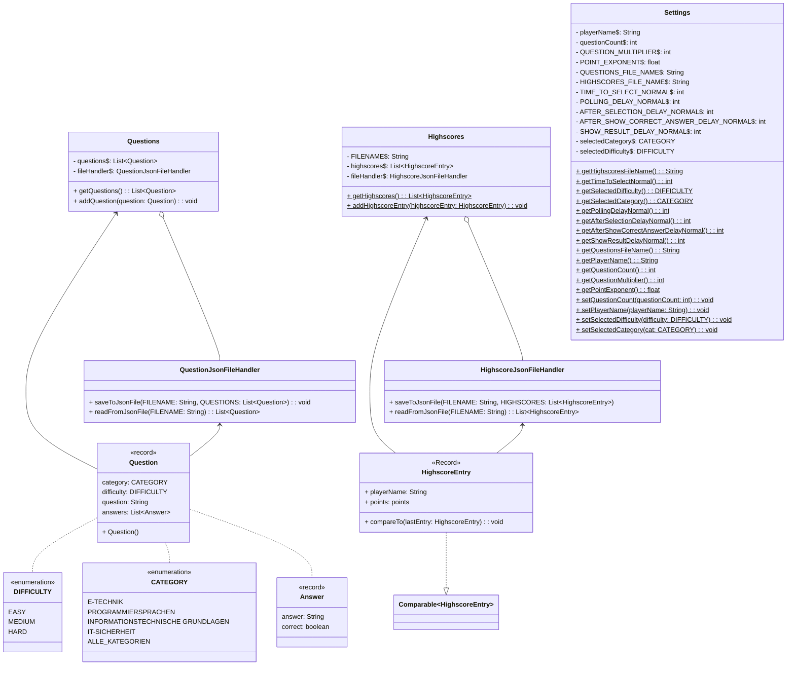

# Klassendiagramm Backend

```mermaid
  classDiagram

  Questions <-- Question
  Questions o-- QuestionJsonFileHandler
  QuestionJsonFileHandler <-- Question
  Question .. DIFFICULTY
  Question .. CATEGORY
  Question .. Answer

  Highscores <-- HighscoreEntry
  Highscores o-- HighscoreJsonFileHandler
  HighscoreJsonFileHandler <-- HighscoreEntry
  HighscoreEntry ..|> Comparable~HighscoreEntry~

  class Questions {
    - questions$: List~Question~
    - fileHandler$: QuestionJsonFileHandler
    + getQuestions(): List~Question~
    + addQuestion(question: Question): void
  }

  class Question {
    <<record>>
    category: CATEGORY
    difficulty: DIFFICULTY
    question: String
    answers: List~Answer~
    + Question()
  }

  class CATEGORY {
    <<enumeration>>
    E-TECHNIK
    PROGRAMMIERSPRACHEN
    INFORMATIONSTECHNISCHE GRUNDLAGEN
    IT-SICHERHEIT
    ALLE_KATEGORIEN
  }

  class DIFFICULTY {
    <<enumeration>>
    EASY
    MEDIUM
    HARD
  }

  class Answer {
    <<record>>
    answer: String
    correct: boolean
  }

  class QuestionJsonFileHandler {
    + saveToJsonFile(FILENAME: String, QUESTIONS: List~Question~): void
    + readFromJsonFile(FILENAME: String): List~Question~
  }


  class Highscores {
    - FILENAME$: String
    - highscores$: List~HighscoreEntry~
    - fileHandler$: HighscoreJsonFileHandler
    + getHighscores()$: List~HighscoreEntry~
    + addHighscoreEntry(highscoreEntry: HighscoreEntry)$: void
  }

  class HighscoreEntry {
    <<Record>>
    + playerName: String
    + points: points
    + compareTo(lastEntry: HighscoreEntry): void
  }

  class HighscoreJsonFileHandler {
    + saveToJsonFile(FILENAME: String, HIGHSCORES: List~HighscoreEntry~)
    + readFromJsonFile(FILENAME: String): List~HighscoreEntry~
  }

  class Settings {
    - playerName$: String
    - questionCount$: int
    - QUESTION_MULTIPLIER$: int
    - POINT_EXPONENT$: float
    - QUESTIONS_FILE_NAME$: String
    - HIGHSCORES_FILE_NAME$: String
    - TIME_TO_SELECT_NORMAL$: int
    - POLLING_DELAY_NORMAL$: int
    - AFTER_SELECTION_DELAY_NORMAL$: int
    - AFTER_SHOW_CORRECT_ANSWER_DELAY_NORMAL$: int
    - SHOW_RESULT_DELAY_NORMAL$: int
    - selectedCategory$: CATEGORY
    - selectedDifficulty$: DIFFICULTY
    + getHighscoresFileName()$: String
    + getTimeToSelectNormal()$: int
    + getSelectedDifficulty()$: DIFFICULTY
    + getSelectedCategory()$: CATEGORY
    + getPollingDelayNormal()$: int
    + getAfterSelectionDelayNormal()$: int
    + getAfterShowCorrectAnswerDelayNormal()$: int
    + getShowResultDelayNormal()$: int
    + getQuestionsFileName()$: String
    + getPlayerName()$: String
    + getQuestionCount()$: int
    + getQuestionMultiplier()$: int
    + getPointExponent()$: float
    + setQuestionCount(questionCount: int)$: void
    + setPlayerName(playerName: String)$: void
    + setSelectedDifficulty(difficulty: DIFFICULTY)$: void
    + setSelectedCategory(cat: CATEGORY)$: void
  }
```
